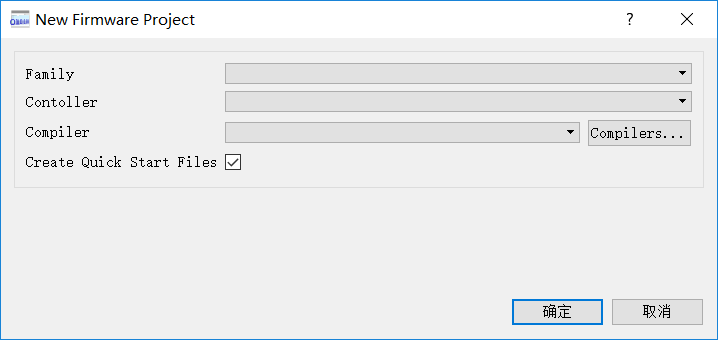
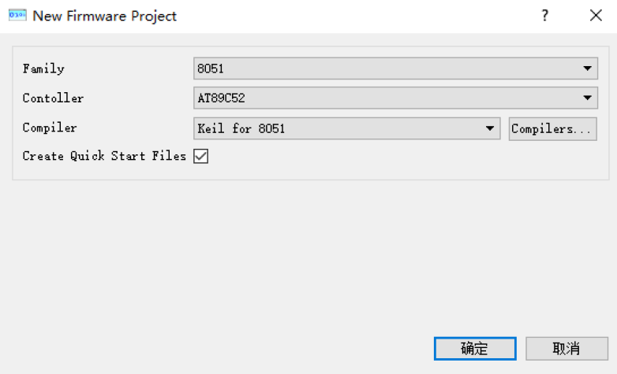

Keil报错failed to execute 'd:\Keil\C51\BIN\C51.EXE'
------
###keil软件报错如下：
--- Error: failed to execute 'd:\Keil\C51\BIN\C51.EXE'

TOOLS.INI配置文件的路径，与放置Keil的实际路径不符。

###解决办法：
* 找到自己的keil安装目录下TOOLS.INI文件。
* 用记事本打开这个文件，找到：[C51] PATH="d:\Keil\C51"
或类似字样，将PATH=后面的内容改为自己keil实际安装的目录，最后一个文件夹是C51。

* 我的keil装在了D:\study tools\Embedded tools\C51这个目录，那么最后类似于这样：
[C51]
PATH="D:\study tools\Embedded tools\C51"

* 然后保存TOOLS.INI,重启keil即可生效（务必要重启keil）

Proteus的New Firmware Project是空的
--------
###Proteus软件显示如下：

###解决办法：
* 将Proteus装在C盘或者D盘的Program files (x86)\Labcenter Electronics文件下。
* 我的装在了D:\Program Files (x86)\Labcenter Electronics。
* 重新打开如图：
