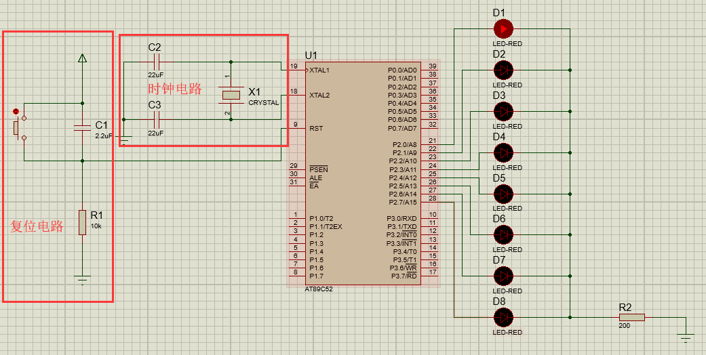
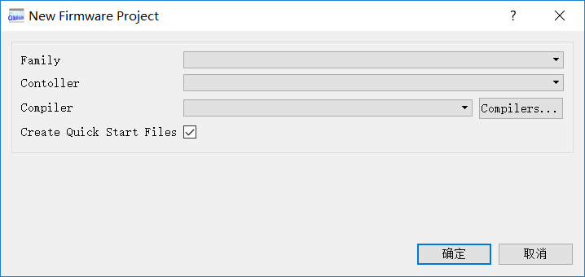
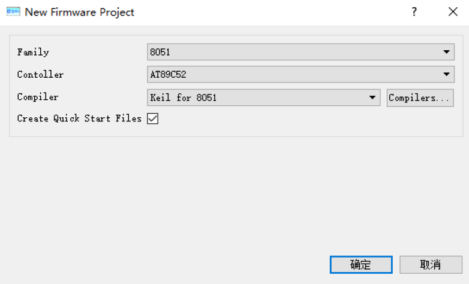
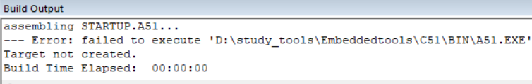
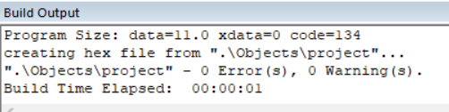

#
 EE114 Lab1:51 单片机概述及最小系统搭建
#
实验报告 

###
 姓名：梁家伟 学号：98277894
------
##I.实验要求
* 根据实验指导书lab1介绍内容，完成 51 单片机最小系统的 Proteus 仿真、搭建和Keil程序实现。
 （注：报告内容中主要为实验结果和遇到问题的分析，软件下载安装和程序搭建过程完全参照实验指导书，此处不再赘述） 
##II.C51 单片机最小系统的仿真及搭建
###1.使用Proteus 搭建C51 单片机最小系统

###2.使用Keil编写C51单片机最小系统的程序
1.正常跑马灯程序代码与在实验指导书相同。
 
2.第一种两个两个亮（无重复）的跑马灯二进制下数值为：

第一次 | 第二次 | 第三次 | 第四次
:-: | :-: | :-: | :-:
11 | 1100 | 110000 | 11000000

程序如下：
<pre>
#include<reg52.h>
void delay(int);
void main()
{
	int i;
	P2=0x03;       //初始值为11（二进制）
	delay(500);
	while(1)
	{
		for(i=0;i<3;i++)  //共循环4次
		{
			P2<<=2;    //向左移两位，例如：11->1100(二进制)
			delay(500);
		}
		P2=0x03;
		delay(500);
	}
}
void delay(int x)
	{
	int i,j;
	for(i=x;i>0l;i--)
		for(j=110;j>0;j--);
}</pre>

3.第二种两个两个亮（有重复）的跑马灯二进制下数值为：

第一次 | 第二次 | 第三次 | 第四次 | 第五次 | 第六次 | 第七次
:-: | :-: | :-: | :-: | :-: | :-: | :-:
11 | 110 | 1100 | 11000 | 110000 | 1100000 | 11000000 

程序如下：
<pre>
#include<reg52.h>
void delay(int);
void main()
{
	int i;
	P2=0x03;        //初始值为11（二进制）
	delay(500);
	while(1)
	{
		for(i=0;i<6;i++)   //共循环7次
		{
			P2<<=1;     //向左移两位，例如：11->1100(二进制)
			delay(500);
		}
		P2=0x03;
		delay(500);
	}
}
void delay(int x)
	{
	int i,j;
	for(i=x;i>0l;i--)
		for(j=110;j>0;j--);
}</pre>

##III.软件安装和程序调试时遇到的问题及解决办法

###1.Proteus的New Firmware Project异常
####Proteus软件显示如下：

####解决办法：
* 将Proteus装在C盘或者D盘的Program files (x86)\Labcenter Electronics文件下。
* 我的装在了D:\Program Files (x86)\Labcenter Electronics。
* 重新打开如图：

###2.Keil软件Build target files时报错
####keil软件运行main.c文件时报错如下：
--- Error: failed to execute 'd:\Keil\C51\BIN\C51.EXE'
Target not created

####原因
TOOLS.INI配置文件的路径，与放置Keil的实际路径不符。
####解决办法：
* 找到keil安装目录下TOOLS.INI文件。
* 用记事本打开TOOLS.INI，将[C51] PATH="d:\Keil\C51"
中PATH=后面的内容改为自己keil实际安装的目录。

* 我的keil装在了D:\study_tools\Embedded_tools\C51这个目录，那么最后类似于这样：
[C51]
PATH="D:\study_tools\Embedded_tools\C51"。

* 然后保存TOOLS.INI,重启keil后问题解决。

