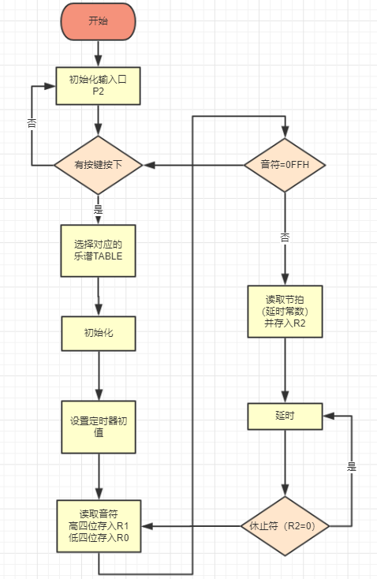
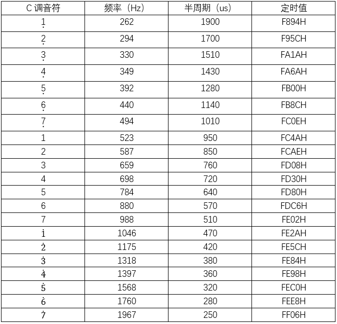
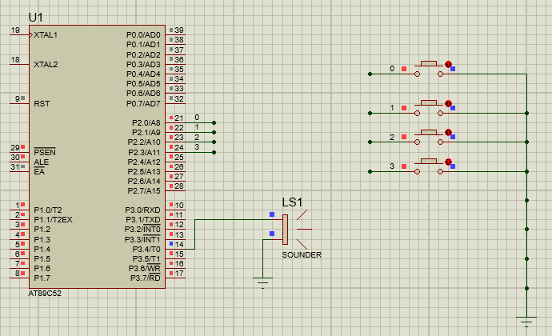

#
 EE114 Lab#1p单片机汇编语言基本编程以及GPIO操作
#
实验报告 

###
Due:2018.10.09 

###
 姓名：梁家伟 学号：98277894 
------
##作业要求
1.	编写汇编程序，播放一段音乐片段（需要有不同节拍）。阐述实现原理，分析代码延时，使用程序框图等描述编程思路。(50%)
2.	使用 Protues 仿真或者在试验箱硬件播放该音乐片段。(10%)
3.	通过按键连接 I/O 口，控制 8051 选择播放不同的预设音乐。阐述编程思路。(20%)
4.	自由发挥部分。(20%)

##I.原理
 

###实现音乐播放原理

* 找对应乐谱的音符，根据下表给出的定时值按乐谱的音符顺序建立编码表TABLE。将十六进制四位数分为两个数，分别存入定时器高位TH0和低位TL0，如1对应为FC4AH，拆分为FCH和4AH,FCH存入高位TH0，4A存入低位TL0。
* 使用定时器T0方式1产生乐谱中各音符对应的音频脉冲，由P3.4输出，经蜂鸣器发出不同音节的声音。
* 节拍是通过调用延时子程序DELAY的次数来实现，每次DELAY延时为1/4拍，即178ms，1拍需要调用4次DELAY，3/4拍需要调用3次DELAY，2/4拍需要调用2次DELAY。节拍的控制码在表TABLE中位于音符码的后面。如"0FDH,080H,03H"中，0FDH和80H是音符5的音符码，03H是节拍码，即3/4拍的时间。
* 当一个音符的发音结束，指针指向下一个一个音符的音符码和节拍码，依次进行下去。
 

##II.程序设计和实现
###1. 函数名称
* CSONG：选择歌曲，按第一个按钮播放第一首歌，按第二个按钮播放第二首歌    
* START：程序开始的进入点   
* LOOP：处理每一个音符      
* TIMING：设置定时初值   
* TIMING0：关闭定时器、停止发音   
* TIMING1：读取延时常数   
* LOOP1：处理节拍时间   
* EXIT：中断子程序   
* DELAY+D2+D3：延时187ms（1/4拍）   

###2. 寄存器使用分配情况

* R0~R7：R0存放低位定时器初值,R1存放高位定时器初值,R2存放延时常数,R5、R6、R7在延时子程序中作计时器用。   
* A和DPTR：A累加器，DPTR为数据指针。把TABLE的首地址存入DPTR，A作为变址寄存器。将基址寄存器和变址寄存器的内容相加（@A+DPTR）形成操作数的地址。   
* TMOD：定时器工作模式控制寄存器。   
* TH0和TL0：定时器0的计数器，TH0为高8位，TL0为低8位。   
* TR0：定时器0控制寄存器TCON的一个控制位。   
* IE：中断允许控制寄存器。   
* P3.4：对内是P3寄存器的一个位，对外是I/O端口的一个引脚，作音频信号输出端口。   

###3. 代码分析 （代码在最后）
* 01~08：设定入口地址。将P2作为按键输入I/0口，标号EXIT进入中断子程序。   
* 12~30：根据P2口输入变化，选择播放指定TABLE中的乐曲，并将首地址存入指针DPTR中（MOV DPTR,#TABLE）
* 36~39：设置定时器T0为方式1，并允许T0中断
* 43~58：从TABLE中取出第一个码，即音符高位部分，并存入寄存器R1中。取出第二个码，即音符低位部分，存入R0。判断两个码是否为休止符（ORL A,R1）或者终止符（ANL A,R1）,如果是休止符，关闭定时器（跳转到TIMING0）；如果是终止符，跳转到CSONG，等待重新有乐曲被选择  
* 60~64：向定时器装入定时常数并启动定时器。   
* 66~67:关闭定时器，停止发音（TIMING0） 
* 69~73：读取延时常数，存入R2  
* 75~79：根据R2中节拍数，决定延时次数，最后跳回到LOOP处理下一个音符   
* 80~84：中断子程序。  
* 86~97：延时187ms子程序      ((248*2+1+3)*187+3)*2us≈187ms   
* 99~226：乐曲音符TABLE，每个音节由3个码组成，第一个是高四位音符码，第二个是低四位音符码，最后一个为节拍码.如"0FDH,080H,03H"中，0FDH是音符5的高四位音符码，80H是音符5的低四位音符码，03H是节拍码，即3/4拍的时间。
* 230：程序结束。
###4. 电路图
 

	

* 按钮0，播放乐曲1（生日快乐歌）
* 按钮1，播放乐曲2（纸短情长（片段））
* 按钮2，播放乐曲3（卡路里（一句*4））
* 按钮3，播放乐曲4（成都（片段））
* 注：只有当播放完毕才能再次切歌，可根据接口输入增加歌曲数目。

###5.Code
    1. 			ORG 0000H
    2. 			;P2 as input
    3. 			MOV A,#0FFH
    4. 			MOV P2,A
    5. 			SJMP CSONG
    6. 
    7. 			ORG 000BH
    8. 			SJMP EXIT
    9. 			
    10. 			
    11.		
    12. CSONG:
    13. 			
    14. 			MOV A,P2
    15. 			CJNE A,#0FEH,SONG2
    16. SONG1:
    17. 			MOV DPTR,#TABLE1
    18. 			SJMP START
    19. SONG2:
    20. 			CJNE A,#0FDH,SONG3
    21. 			MOV DPTR,#TABLE2
    22. 			SJMP START
    23. SONG3:
    24. 			CJNE A,#0FBH,SONG4
    25. 			MOV DPTR,#TABLE3
    26. 			SJMP START	
    27. SONG4:
    28. 			CJNE A,#0F7H,SONG5
    29. 			MOV DPTR,#TABLE4
    30. 			SJMP START			
    31. 			
    32. SONG5:
    33. 			CJNE A,#0FFH,CSONG
    34. 			SJMP CSONG
    35. 
    36. START:
    37. 			MOV B,A
    38. 			MOV TMOD,#1H
    39. 			MOV IE,#82H
    40. 			
    41. 			
    42. 			
    43. LOOP:
    44. 			CLR A
    45. 			MOVC A,@A+DPTR
    46. 			MOV R1,A
    47. 			INC DPTR
    48. 			CLR A
    49. 			MOVC A,@A+DPTR
    50. 			MOV R0,A
    51. 			
    52. 			ORL A,R1
    53. 			JZ TIMING0                  ;or,stop(R1=R0=00H)
    54. 			
    55. 			MOV A,R0
    56. 			ANL A,R1
    57. 			CJNE A,#0FFH,TIMING         ;and,finish(R1=R0=0FFH)
    58. 			JMP CSONG
    59. 			
    60. TIMING:
    61. 			MOV TH0,R1                  ;HIGH
    62. 			MOV TL0,R0
    63. 			SETB TR0
    64. 			JMP TIMING1
    65. 
    66. TIMING0: 
    67. 			CLR TR0
    68. 
    69. TIMING1:
    70. 			CLR A
    71. 			INC DPTR
    72. 			MOVC A,@A+DPTR
    73. 			MOV R2,A
    74. 			
    75. LOOP1:  
    76. 			ACALL DELAY
    77. 			DJNZ R2,LOOP1
    78. 			INC DPTR
    79. 			JMP LOOP
    80. EXIT:
    81. 			MOV TH0,R1
    82. 			MOV TL0,R0
    83. 			CPL P3.4
    84. 			RETI
    85. 			
    86. DELAY:  
    87. 			MOV R7,#02
    88. 			
    89. D2: 
    90. 			MOV R6,#187
    91. 
    92. D3: 
    93. 			MOV R5,#248
    94. 			DJNZ R5,$
    95. 			DJNZ R6,D3
    96. 			DJNZ R7,D2
    97. 			RET
    98. 			
    99. TABLE1:
    100. 			DB 0FDH,080H,03H,   0FDH,80H,01H          ;TH0,TL0,beat
    101. 			DB 0FDH,0C6H,04H,   0FDH,80H,04H
    102. 			DB 0FEH,02AH,04H,   0FEH,02H,04H
    103. 			DB 000H,000H,04H
    104. 			DB 0FDH,080H,03H,   0FDH,80H,01H
    105. 			DB 0FDH,0C6H,04H,   0FDH,80H,04H
    106. 			DB 0FEH,05CH,04H,   0FEH,2AH,04H
    107. 			DB 000H,000H,04H
    108. 			DB 0FDH,080H,03H,   0FDH,80H,01H
    109. 			DB 0FEH,0C0H,04H,   0FEH,84H,04H
    110. 			DB 0FEH,02AH,04H,   0FEH,02H,04H
    111. 			DB 0FDH,0C6H,04H
    112. 			DB 0FEH,098H,03H,   0FEH,98H,01H
    113. 			DB 0FEH,084H,04H,   0FEH,2AH,04H
    114. 			DB 0FEH,05CH,04H,   0FEH,2AH,04H
    115. 			DB 000H,000H,04H
    116. 			DB 0FFH,0FFH
    117. 				
    118. TABLE2:
    119. 			;1.  0F8H,94H,02H            对应音符的音符码
    120. 			;2.  0F9H,5CH,02H
    121. 			;3.  0FAH,1AH,02H
    122. 			;4.  0FAH,6AH,02H
    123. 			;5.  0FBH,00H,02H
    124. 			;6.  0FBH,8CH,02H
    125. 			;7.  0FCH,0EH,02H
    126. 			;1   0FCH,4AH,02H
    127. 			;2   0FCH,0AEH,02H
    128. 			;3   0FDH,08H,02H
    129. 			;4   0FDH,30H,02H
    130. 			;5   0FDH,80H,02H
    131. 			;6   0FDH,0C6H,02H
    132. 			;7   0FEH,02H,02H
    133. 			;.1  0FEH,2AH,02H
    134. 			;.2  0FEH,5CH,02H
    135. 			;.3  0FEH,84H,02H
    136. 			;.4  0FEH,98H,02H
    137. 			;.5  0FEH,0C0H,02H
    138. 			;.6  0FEH,0E8H,02H
    139. 			;.7  0FFH,06H,02H
    140. 			DB 0FCH,4AH,02H,   0FCH,4AH,02H
    141. 			DB 0FCH,0AEH,04H,  0FDH,08H,04H
    142. 			DB 0FDH,08H,02H,   0FDH,08H,02H
    143. 				
    144. 			DB 00H,00H,02H,0FDH,08H,02H
    145. 			DB 0FCH,0AEH,02H,  0FCH,4AH,02H
    146. 			DB 0FCH,0EH,04H,   0FDH,0C6H,02H
    147. 			DB 0FDH,80H,02H
    148. 				
    149. 			DB 00H,00H,02H,0FDH,80H,05H
    150. 			DB 0FDH,0C6H,02H,  0FEH,02H,02H
    151. 			DB 0FEH,2AH,04H,   0FDH,08H,02H
    152. 			DB 0FDH,08H,02H
    153. 				
    154. 			DB 00H,00H,02H,0FEH,2AH,02H
    155. 			DB 0FEH,02H,02H,   0FEH,2AH,02H
    156. 			DB 0FEH,02H,04H,   0FDH,08H,02H
    157. 			DB 0FDH,80H,04H
    158. 
    159. 			DB 0FDH,80H,02H,   0FDH,0C6H,02H
    160. 			DB 0FEH,2AH,02H,   0FDH,80H,04H
    161. 			DB 0FDH,0C6H,02H
    162. 				
    163. 			DB 00H,00H,02H,0FDH,0C6H,02H
    164. 			DB 0FDH,80H,02H,   0FDH,30H,02H
    165. 			DB 0FDH,80H,02H,   0FDH,08H,04H
    166. 			DB 0FCH,0AEH,02H,  0FCH,4AH,02H
    167. 				
    168. 			DB 0FBH,8CH,01H,   0FCH,4AH,01H
    169. 			DB 0FDH,08H,02H,   0FCH,0AEH,02H
    170. 			DB 0FCH,0AEH,02H,  0FCH,4AH,02H
    171. 			DB 0FCH,0AEH,02H,  0FDH,80H,04H
    172. 			DB 0FCH,4AH,02H,   0FCH,0AEH,08H
    173. 			DB 0FFH,0FFH
    174. 				
    175. 				
    176. TABLE3:
    177. 			DB 0FDH,0C6H,01H,   0FEH,0E8H,01H
    178. 			DB 0FCH,0AEH,01H,   0FDH,008H,01H
    179. 			DB 0FDH,0C6H,01H,   0FEH,002H,01H
    180. 			DB 0FCH,0AEH,01H，  00H,00H,02H
    181. 			DB 0FDH,0C6H,01H,   0FEH,0E8H,01H
    182. 			DB 0FCH,0AEH,01H,   0FDH,008H,01H
    183. 			DB 0FDH,0C6H,01H,   0FEH,002H,01H
    184. 			DB 0FCH,0AEH,01H,   00H,00H,02H
    185. 			DB 0FDH,0C6H,01H,   0FEH,0E8H,01H
    186. 			DB 0FCH,0AEH,01H,   0FDH,008H,01H
    187. 			DB 0FDH,0C6H,01H,   0FEH,002H,01H
    188. 			DB 0FCH,0AEH,01H;,   0FDH,008H,01H
    189. 			DB 00H,00H,02H
    190. 			DB 0FDH,0C6H,01H,   0FEH,0E8H,01H
    191. 			DB 0FCH,0AEH,01H,   0FDH,008H,01H
    192. 			DB 0FDH,0C6H,01H,   0FEH,002H,01H
    193. 			DB 0FCH,0AEH,01H;,   0FDH,008H,01H
    194. 			DB 00H,00H,02H
    195. 			DB 0FFH,0FFH
    196. 				
    197. TABLE4:
    198. 		
    199. 			
    200. 			DB 0FDH,08H,02H,   0FDH,80H,04H
    201. 			DB 0FDH,80H,02H,   0FDH,80H,02H
    202. 			DB 0FDH,08H,02H,   0FDH,80H,02H
    203. 			
    204. 			DB 0FDH,0C6H,04H,  0FDH,0C6H,02H
    205. 			DB 0FDH,08H,04H  
    206. 				
    207. 			DB 0FCH,0AEH,02H,  0FCH,4AH,04H
    208. 			DB 0FCH,4AH,02H,   0FCH,0AEH,04H
    209. 			DB 0FDH,80H,02H,   0FDH,08H,04H
    210. 			DB 0FDH,08H,04H
    211. 				
    212. 			
    213. 			
    214. 			DB 0FDH,08H,02H,   0FDH,80H,04H
    215. 			DB 0FDH,80H,02H,   0FDH,80H,02H
    216. 			DB 0FDH,08H,02H,   0FDH,80H,02H
    217. 			
    218. 			DB 0FDH,0C6H,04H,  0FDH,0C6H,02H
    219. 			DB 0FDH,08H,04H  
    220. 				
    221. 			DB 0FCH,0AEH,02H,  0FCH,4AH,04H
    222. 			DB 0FBH,00H,02H,   0FCH,0AEH,04H
    223. 			DB 0FDH,08H,02H,   0FCH,4AH,04H
    224. 			DB 0FCH,4AH,04H
    225. 			
    226. 			DB 0FFH,0FFH
    227. 				
    228. 				
    229. 			
    230. 			END
##所有源文件地址
[https://github.com/Mine4ever/Embedded_Lab/tree/master/Lab1p](https://github.com/Mine4ever/Embedded_Lab/tree/master/Lab1p)
##参考资料
* 51单片机实例按键识别方法之一[https://wenku.baidu.com/view/ea4fabcab84ae45c3b358cf8.html](https://wenku.baidu.com/view/ea4fabcab84ae45c3b358cf8.html)
* proteus 基于单片机的按键选播电子音乐[https://wenku.baidu.com/view/57d64c230066f5335a81211f.html](https://wenku.baidu.com/view/57d64c230066f5335a81211f.html)
* 使用 8051单片机播放音乐[http://book.51cto.com/art/201012/237444.htm](http://book.51cto.com/art/201012/237444.htm)